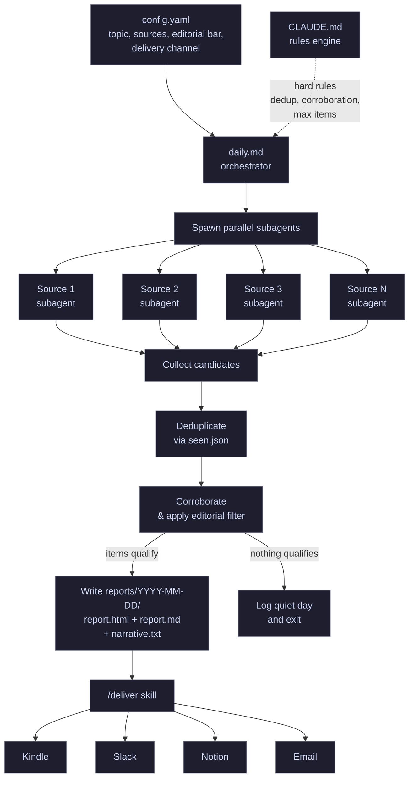

# daily-research-report

Automated daily research pipeline powered by [Claude Code](https://claude.ai/code). Configure a topic, point it at your sources, pick a delivery channel, and get a curated brief every day.

No traditional app code -- just configuration files that steer Claude Code's research behavior.

## How it works



## Quick start

### Prerequisites

- [Claude Code CLI](https://claude.ai/code) installed and authenticated
- Python 3.10+ (for the delivery script)
- `pip install python-dotenv pyyaml` (optional but recommended)

### Setup

```bash
git clone https://github.com/YOUR_USERNAME/daily-research-report.git
cd daily-research-report

# 1. Configure your topic and sources
#    Edit config.yaml (see "Configuration" below)

# 2. Set up delivery credentials
cp .env.example .env
# Fill in the values for your chosen delivery channel

# 3. First run — backfill seen.json with 90 days of history
claude -p first.md --allowedTools WebSearch,WebFetch,Task,Write,Bash,Read

# 4. Daily runs — research + report + delivery
claude -p daily.md --allowedTools WebSearch,WebFetch,Task,Write,Bash,Read
```

### Schedule it

**Linux/macOS (cron):**
```bash
# Every day at 6 AM
0 6 * * * cd /path/to/daily-research-report && claude -p daily.md --allowedTools WebSearch,WebFetch,Task,Write,Bash,Read
```

**Windows (Task Scheduler):**
Create a task that runs:
```
claude -p daily.md --allowedTools WebSearch,WebFetch,Task,Write,Bash,Read
```
with the working directory set to your clone of this repo.

## Configuration

Edit `config.yaml` to define your research pipeline:

```yaml
# What to research
name: "My Daily Brief"
topic: >
  Describe what you care about. Be specific about tools, frameworks, or
  domains you use day-to-day so the filter stays tight.

editorial_bar: >
  Include only if this would directly improve the reader's workflow today.

# Constraints
max_items: 12
narrative_max_words: 600
lookback_hours: 24

# Sources -- add or remove as needed
sources:
  reddit:
    - r/YourSubreddit
  huggingface:
    categories: ["text-generation", "image-classification"]
  github:
    repos:
      - owner/repo
    blogs:
      - https://example.com/blog
  web:
    - https://example.com/changelog

  # Pages that update in-place (changelogs, RFCs, roadmaps).
  # These skip dedup and get fetched every run.
  evergreen:
    - https://example.com/changelog
    - https://example.com/roadmap

# Report sections (omit if empty)
sections:
  - "Featured"
  - "Tools & Libraries"
  - "Techniques & Workflows"
  - "Ecosystem & Community"

# Delivery channel
delivery:
  channel: slack  # kindle | slack | notion | email
```

## Delivery channels

### Kindle

Send `report.html` as an email attachment to your Kindle.

```env
KINDLE_GMAIL_USER=you@gmail.com
KINDLE_GMAIL_APP_PASS=xxxx xxxx xxxx xxxx
KINDLE_EMAIL=you@kindle.com
```

Create a Gmail app password at [myaccount.google.com/apppasswords](https://myaccount.google.com/apppasswords). Add your Gmail address to your Kindle's [approved senders](https://www.amazon.com/hz/mycd/myx#/home/settings/payment).

### Slack

Post the report to a Slack channel via incoming webhook.

```env
SLACK_WEBHOOK_URL=https://hooks.slack.com/services/T.../B.../xxx
```

Create a webhook at [api.slack.com/messaging/webhooks](https://api.slack.com/messaging/webhooks).

### Notion

Create a new page in a Notion database with the report content.

```env
NOTION_API_KEY=ntn_xxx
NOTION_DATABASE_ID=abc123
```

Create an integration at [notion.so/my-integrations](https://www.notion.so/my-integrations). Share the target database with your integration.

### Email

Send `report.html` as an inline HTML email via any SMTP server.

```env
EMAIL_SMTP_HOST=smtp.gmail.com
EMAIL_SMTP_PORT=465
EMAIL_SMTP_USER=you@gmail.com
EMAIL_SMTP_PASS=xxxx
EMAIL_TO=recipient@example.com
```

## Output

Each run produces files in `reports/YYYY-MM-DD/`:

| File | Purpose |
|------|---------|
| `report.html` | Styled report for reading (primary delivery artifact) |
| `report.md` | Markdown version for terminal reading |
| `narrative.txt` | Short prose summary, written for listening apps |
| `run.log` | Audit log of what was searched, found, and why |

Reports older than 7 days are automatically purged.

## Example configs

<details>
<summary>AI/ML tools for creative professionals</summary>

```yaml
name: "AI Tools Daily"
topic: >
  Open-source AI tools for image generation, video generation, and 3D asset
  creation. Focused on practical releases that run on consumer GPUs.
sources:
  reddit: [r/StableDiffusion, r/comfyui, r/LocalLLaMA]
  huggingface:
    categories: [image-editing, image-to-video, text-to-video, text-to-3d]
  github:
    repos: [comfyanonymous/ComfyUI, Lightricks/LTX-Video]
    blogs: [https://blog.comfy.org]
  web: [https://civitai.com]
sections: ["Featured", "Models & Checkpoints", "Workflows", "Developer Tools"]
delivery:
  channel: kindle
```
</details>

<details>
<summary>Frontend development</summary>

```yaml
name: "Frontend Daily"
topic: >
  Frontend web development: React, Next.js, Tailwind, TypeScript, Vite,
  browser APIs, and CSS. Focused on production-ready tools and techniques.
sources:
  reddit: [r/reactjs, r/nextjs, r/webdev, r/typescript]
  github:
    repos: [vercel/next.js, vitejs/vite, tailwindlabs/tailwindcss]
    blogs: [https://nextjs.org/blog, https://vitejs.dev/blog]
  web: [https://developer.chrome.com/blog]
sections: ["Featured", "Frameworks & Libraries", "Performance", "Developer Experience"]
delivery:
  channel: slack
```
</details>

<details>
<summary>DevOps and infrastructure</summary>

```yaml
name: "Infra Brief"
topic: >
  Cloud infrastructure, Kubernetes, Terraform, observability, and CI/CD.
  Focused on production reliability and cost optimization.
sources:
  reddit: [r/devops, r/kubernetes, r/terraform]
  github:
    repos: [kubernetes/kubernetes, hashicorp/terraform, grafana/grafana]
    blogs: [https://kubernetes.io/blog, https://www.hashicorp.com/blog]
  web: [https://aws.amazon.com/new, https://cloud.google.com/blog]
sections: ["Featured", "Infrastructure", "Observability", "Security"]
delivery:
  channel: notion
```
</details>

## License

MIT
