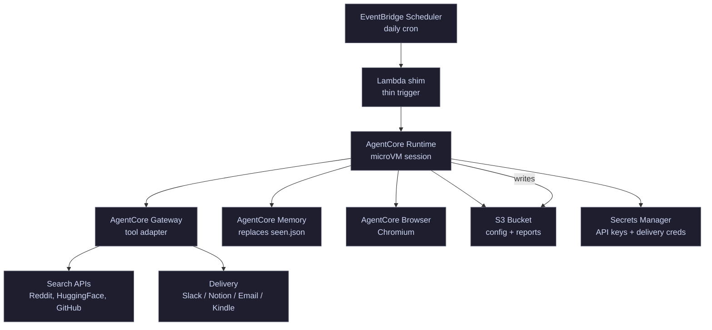

# AWS AgentCore Deployment

Deploy daily-research-report as a managed AI agent on Amazon Bedrock AgentCore.

## Architecture



## How It Works

1. **EventBridge Scheduler** fires daily (e.g., 6 AM UTC)
2. **Lambda shim** invokes AgentCore Runtime asynchronously with the session payload
3. **AgentCore Runtime** spins up an isolated microVM and runs the agent:
   - Pulls `config.yaml` from S3
   - Reads prior state from AgentCore Memory (replaces `seen.json`)
   - Spawns parallel research tasks using Gateway-connected tools
   - Uses Browser tool for sources that need page rendering
   - Applies editorial filter, corroboration, dedup
   - Writes `report.html`, `report.md`, `narrative.txt` to S3
   - Delivers via the configured channel through Gateway
   - Updates Memory with new seen entries
4. CPU billing pauses during all LLM and API wait time

## Components

### S3 Bucket

```
s3://daily-research-report-{account-id}/
├── config.yaml
├── reports/
│   └── YYYY-MM-DD/
│       ├── report.html
│       ├── report.md
│       └── narrative.txt
└── logs/
    └── YYYY-MM-DD/
        └── run.log
```

### Secrets Manager

| Secret | Purpose |
|--------|---------|
| `drr/anthropic-api-key` | Claude API authentication |
| `drr/delivery-creds` | Channel-specific credentials (Kindle SMTP, Slack webhook, Notion key, etc.) |

### AgentCore Gateway Tools

Register these as agent-callable tools via Gateway:

| Tool | Source | Purpose |
|------|--------|---------|
| `search_reddit` | Reddit API or web search | Subreddit research |
| `search_huggingface` | HuggingFace API | Model discovery |
| `fetch_github_releases` | GitHub API | Release monitoring |
| `fetch_url` | Browser tool | General web fetching, evergreen URLs |
| `deliver_slack` | Slack webhook API | Slack delivery |
| `deliver_notion` | Notion API | Notion delivery |
| `deliver_email` | Lambda (SMTP) | Email/Kindle delivery |

### AgentCore Memory

Replaces the local `seen.json` file:

- **Short-term memory**: current session's candidates and decisions
- **Long-term memory**: seen items (title + URLs), rolling 7-day window
- Memory retrieval checks for duplicates before including candidates
- Evergreen URLs skip the memory check (same as local dedup rules)

### Lambda Shim

Minimal function (~20 lines) that bridges EventBridge to AgentCore:

```python
import boto3
import json
import os

agentcore = boto3.client("bedrock-agentcore-runtime")

def handler(event, context):
    response = agentcore.invoke_agent_runtime(
        agentRuntimeId=os.environ["AGENT_RUNTIME_ID"],
        invocationType="ASYNC",
        payload=json.dumps({
            "prompt": "daily",
            "config_s3": os.environ["CONFIG_S3_URI"],
        }),
    )
    return {"statusCode": 200, "sessionId": response["sessionId"]}
```

### Dockerfile

```dockerfile
FROM python:3.12-slim

WORKDIR /app

COPY config.yaml daily.md first.md CLAUDE.md ./
COPY .claude/ .claude/

RUN pip install anthropic pyyaml

# AgentCore Runtime expects an entrypoint that accepts the session payload
COPY entrypoint.py .
CMD ["python", "entrypoint.py"]
```

## Estimated Cost Per Run

| Component | Estimate |
|-----------|----------|
| AgentCore CPU (~3 min active, rest is I/O wait) | ~$0.004 |
| AgentCore Memory (read + write ~50 events) | ~$0.03 |
| AgentCore Browser (if used, ~30 sec) | ~$0.001 |
| Gateway invocations (~20 tool calls) | ~$0.0001 |
| Lambda shim | ~$0.0001 |
| S3 storage + requests | ~$0.001 |
| Claude API (main cost) | ~$0.50-2.00 |
| **Total per run** | **~$0.55-2.05** |

Claude API calls dominate cost. Infrastructure is pennies.

## Setup Steps (not yet implemented)

1. Create S3 bucket, upload `config.yaml`
2. Store secrets in Secrets Manager
3. Build and push Docker image to ECR
4. Create AgentCore Runtime with the container
5. Register tools in AgentCore Gateway
6. Create Lambda shim
7. Create EventBridge Scheduler rule
8. Run `first.md` backfill once, then switch to daily schedule

## References

- [Amazon Bedrock AgentCore](https://aws.amazon.com/bedrock/agentcore/)
- [AgentCore Pricing](https://aws.amazon.com/bedrock/agentcore/pricing/)
- [AgentCore Gateway Docs](https://docs.aws.amazon.com/bedrock-agentcore/latest/devguide/built-in-tools.html)
- [Deploy with CloudFormation](https://aws.amazon.com/blogs/machine-learning/build-ai-agents-with-amazon-bedrock-agentcore-using-aws-cloudformation/)
